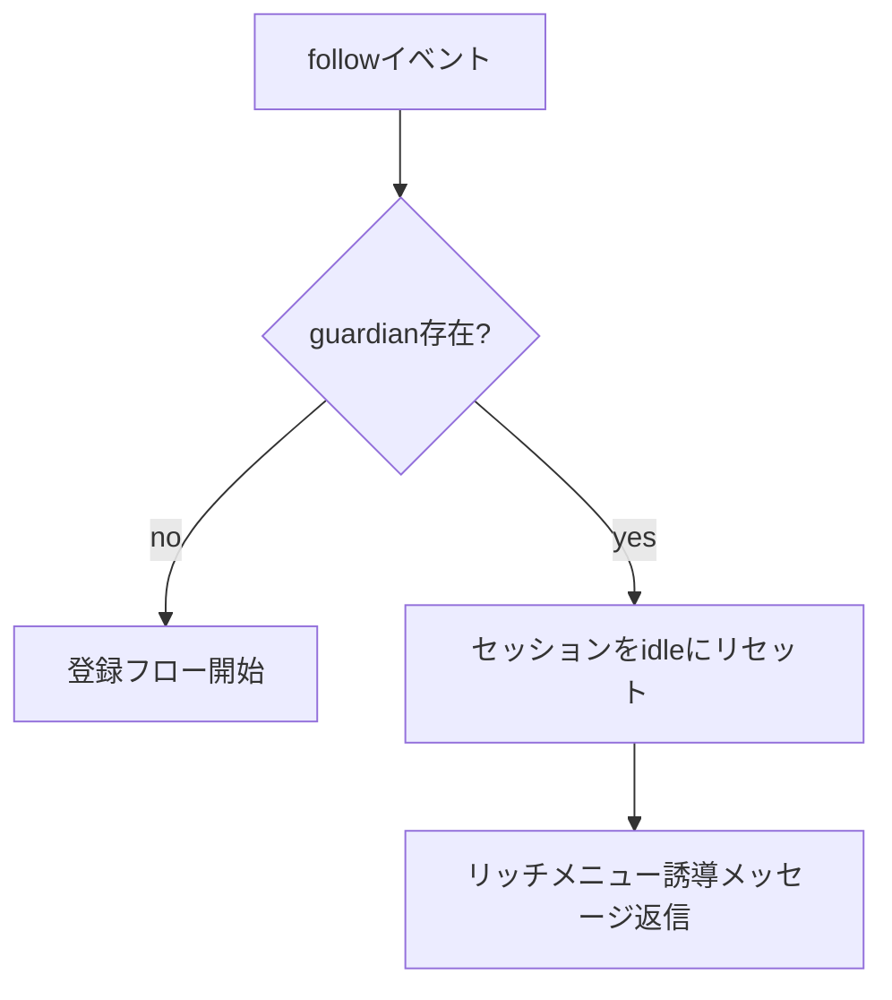
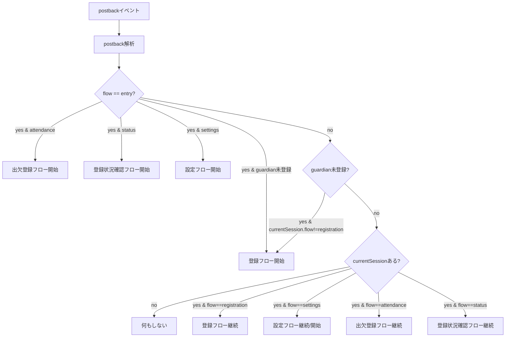
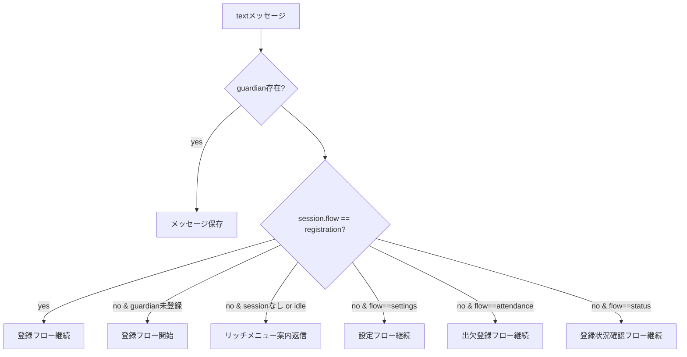
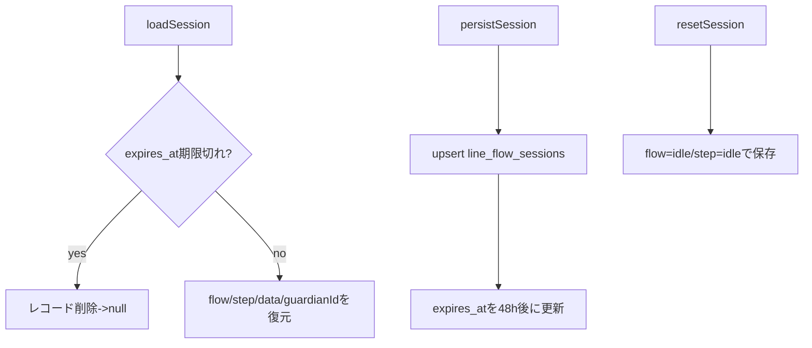
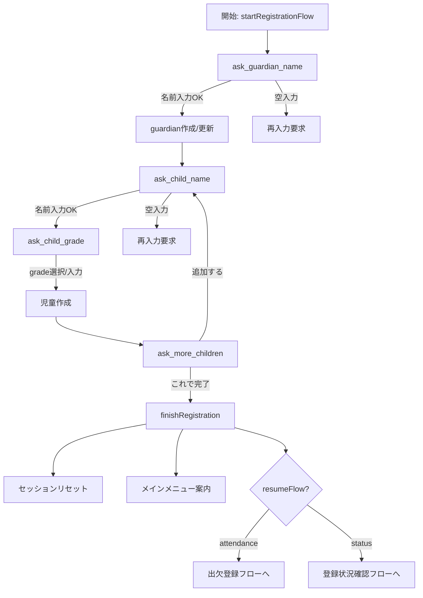
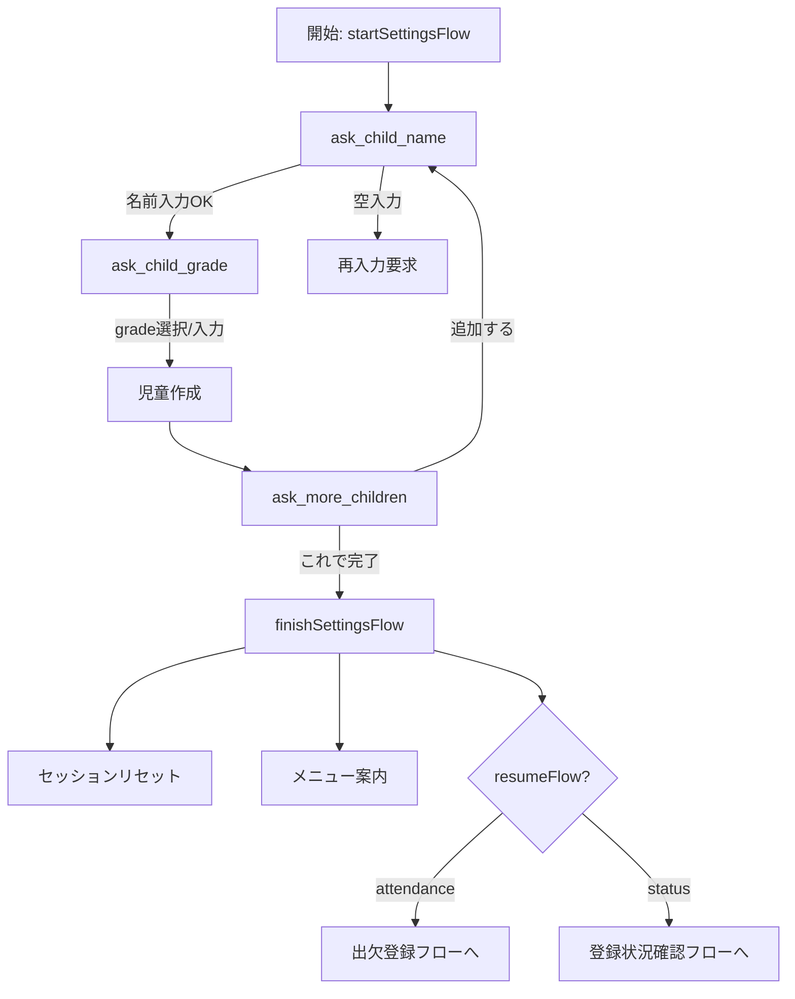

# LINE会話フロー図（Mermaid）

このドキュメントは `src/app/api/line/webhook/route.ts` の実装に基づき、
LINE公式アカウント経由の会話フローを図示したものです。

## 1. Webhook全体の流れ

```mermaid
flowchart TD
  A[LINE Webhook受信 POST] --> B{署名検証}
  B -->|OK| C[events配列を順に処理]
  C --> D{event.source.userId?}
  D -->|no| C
  D -->|yes| E[guardian取得 (line_user_id)]
  E --> F[session取得 (line_flow_sessions)]
  F --> G[handleFollowEvent]
  F --> H[routePostback]
  F --> I[routeMessage]
```

## 2. Followイベント



## 3. Postback（リッチメニュー/クイックリプライ）



## 4. Message（テキストメッセージ）



## 5. セッション保持（line_flow_sessions）



## 6. フロー種別（エントリ）

```mermaid
flowchart LR
  A[entry (リッチメニュー)] --> B[registration]
  A --> C[attendance]
  A --> D[status]
  A --> E[settings]
```

---

# フロー内部ステップ詳細

## A. registration（初期登録）



## B. attendance（出欠登録）

```mermaid
flowchart TD
  A[開始: startAttendanceFlow] --> B{児童存在?}
  B -->|no| C[settingsへ遷移 (resume=attendance)]
  B -->|yes| D[choose_student]

  D -->|児童選択| E[choose_date]
  D -->|名前テキスト一致| E
  D -->|不一致| D1[再選択要求]

  E -->|日付選択/入力| F[choose_status]
  E -->|日付不正| E1[再選択要求]
  E -->|児童ID欠落| E2[セッションリセット→児童選択へ]

  F -->|出欠選択| G[ask_comment]
  F -->|不正値| F1[再選択要求]

  G -->|コメント入力/なし| H[finalizeAttendance]
  H --> I[出欠をupsert]
  H --> J[メッセージ保存]
  H --> K[セッションリセット]
  H --> L[完了通知 + メニュー]
```

## C. status（登録状況確認）

```mermaid
flowchart TD
  A[開始: startStatusFlow] --> B{児童存在?}
  B -->|no| C[settingsへ遷移 (resume=status)]
  B -->|yes| D[choose_student]

  D -->|児童選択| E[choose_range]
  D -->|名前テキスト一致| E
  D -->|不一致| D1[再選択要求]

  E -->|次回〜3回| F[dates生成]
  E -->|今月| G[dates生成]
  E -->|日付指定| H[dates生成]
  E -->|不正| E1[再選択要求]

  F --> I[sendStatusSummary]
  G --> I
  H --> I

  I --> J[出欠マップ取得]
  I --> K[返信文生成]
  I --> L[セッションリセット]
  I --> M[一覧返信 + メニュー]
```

## D. settings（児童追加）


